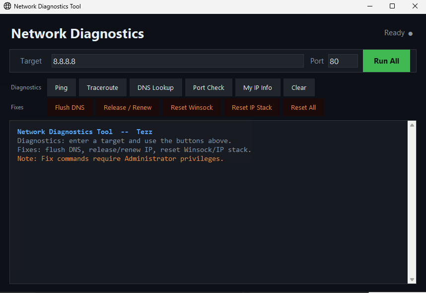

# Network Diagnostics Tool

A desktop network troubleshooting utility built with Python and tkinter. No third-party dependencies — runs on any machine with Python 3.8+ installed.

> Built by a Senior Service Desk Analyst for real-world IT troubleshooting workflows.

---

## Screenshot

> 

---

## Features

### Diagnostics
| Tool | Description |
|---|---|
| Ping | Sends 4 packets to the target, reports reply times and packet loss |
| Traceroute | Maps every hop to the destination, flags timeouts in orange |
| DNS Lookup | Resolves IPv4 and IPv6 addresses, attempts reverse lookup |
| Port Check | Tests a specific port and quick-scans 5 common ports automatically |
| My IP Info | Shows local IP, hostname, default gateway, and DNS servers |
| Run All | Runs all five diagnostics in sequence with one click |

### Fixes
| Tool | Description |
|---|---|
| Flush DNS | Clears the local DNS cache (`ipconfig /flushdns`) |
| Release / Renew | Forces a fresh IP from DHCP (`ipconfig /release` + `/renew`) |
| Reset Winsock | Resets the Winsock catalogue (`netsh winsock reset`) |
| Reset IP Stack | Rebuilds the TCP/IP stack (`netsh int ip reset`) |
| Reset All | Runs all fix commands in sequence |

> Fix commands require Administrator privileges. Right-click your terminal and select **Run as Administrator** before launching the script.

---

## Installation

```bash
git clone https://github.com/Tessie27/network-diagnostics-tool
cd network-diagnostics-tool
python network_diagnostics.py
```

### Requirements
- Python 3.8+
- No pip installs required — uses standard library only (`tkinter`, `socket`, `subprocess`)

---

## Usage

1. Enter a **hostname or IP** in the Target field (e.g. `google.com`, `8.8.8.8`, `192.168.1.1`)
2. Set a **port number** if using Port Check (default: 80)
3. Click **Run All** for a full diagnostic, or use individual buttons
4. Use the **Fixes** row for common remediation steps

### Common targets to test

| Scenario | Target |
|---|---|
| Test internet connectivity | `8.8.8.8` |
| Test DNS resolution | `google.com` |
| Test local gateway | `192.168.1.1` |
| Test internal server | hostname or internal IP |

---

## Output colour coding

| Colour | Meaning |
|---|---|
| Green | Success / open / reachable |
| Orange | Warning / timeout / filtered |
| Red | Error / failure / closed |
| Blue | Labels and section headers |
| Grey | Informational output |

---

## File Structure

```
network-diagnostics-tool/
    network_diagnostics.py   Main application
    web.png                  App icon (place in same folder)
    README.md
```

---

## Roadmap

- [ ] Export results to text file
- [ ] Save favourite targets
- [ ] Wi-Fi signal strength display
- [ ] Scheduled ping monitoring with alerts

---

## License

MIT
